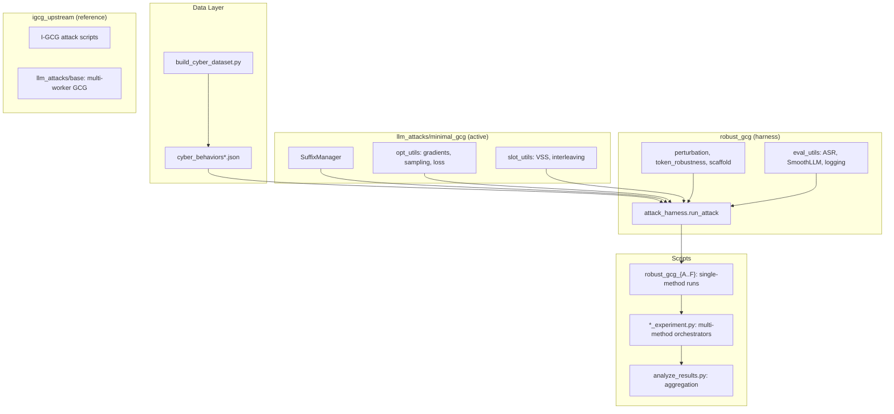

# Robust GCG

Perturbation-aware adversarial suffix optimization for LLMs, extending
[I-GCG](https://arxiv.org/abs/2405.21018) with robustness-aware candidate
selection to produce adversarial suffixes that survive character- and
token-level perturbation defenses (e.g. [SmoothLLM](https://arxiv.org/abs/2310.03684)).

Primary target model: **Qwen-2-7B-Instruct**.
Behavior domain: cyber-security tasks from AdvBench/HarmBench sources.

## Methods

Six robust candidate-selection strategies layered on top of GCG optimization:

| ID | Name | Core idea |
|----|------|-----------|
| **A** | Suffix char perturbation | Perturb suffix characters (swap/insert/patch), re-evaluate loss; pick candidates whose loss is stable under perturbation |
| **B** | Token perturbation | Build token neighborhoods via decode-perturb-retokenize; select candidates with robust token composition |
| **C** | Generation eval | Full-prompt character perturbation + short generation + refusal-keyword check (faithful SmoothLLM simulation, expensive) |
| **D** | Inert buffer / scaffold | Wrap behavior in a code-scaffold with hash-comment buffer; perturb the buffer region only |
| **E** | K-merge | I-GCG-style position-wise top-K candidate merge, picking the best merged suffix by loss |
| **F** | SlotGCG + K-merge | Attention-based interleaved adversarial token slots (VSS) combined with K-merge |

## Setup

### RunPod / A100 (recommended)

```bash
# One-time setup (installs deps on network volume)
bash setup_runpod.sh

# Per-session (activates env, resolves model path, prints status)
source start_session.sh
```

### Local / other GPU

```bash
pip install -e .                     # installs llm_attacks + robust_gcg packages
# or: pip install -r requirements.txt  and set PYTHONPATH to repo root

# Download model
python -c "from transformers import AutoModelForCausalLM; \
  AutoModelForCausalLM.from_pretrained('Qwen/Qwen2-7B-Instruct', torch_dtype='auto')"
```

After setup, verify:

```bash
make status   # GPU, disk, running processes
```

## Quick Start

```bash
# Dry-run the improved experiment (5 steps per condition, ~10 min)
make experiment-improved-dry

# Smoke test: 5 behaviors x 100 steps x methods A,B,C,D (~30 min on A100)
make smoke-test

# Run a single method on one behavior
make robust-f BEHAVIOR_ID=3
```

## Experiments

All experiment scripts live in `scripts/` and write structured JSON to `output/`.
Every experiment has a `--dry_run` flag for quick validation.

### Fast Robust Eval

Loads model once, runs methods A-D (and optionally F) across multiple behaviors
with tiered presets.

```bash
make smoke-test                     # 5 behaviors, 100 steps
make quick-eval                     # 15 behaviors, 200 steps (~3 h)
```

- **Script:** `scripts/fast_robust_eval.py`
- **Output:** `output/fast_eval/<tier>/<timestamp>/`
- **Report:** `fast_eval_report.json` with per-behavior convergence, clean ASR, SmoothLLM sweep

### Improved GCG Experiment

Four-phase comparison on Qwen-2: baseline vs multiflip vs method D (scaffold)
vs method E (k-merge), with multi-tier verification and optional SmoothLLM sweep.

```bash
make experiment-improved             # ~10 h on A100
make experiment-improved-dry         # 5 steps per run
```

- **Script:** `scripts/improved_gcg_experiment.py`
- **Output:** `output/improved_experiment/<timestamp>/`
- **Report:** `experiment_report.json` with convergence, prefix/strict/content ASR, SmoothLLM counts

### Thorough Method D Evaluation

Deep evaluation of method D: multiple seeds, 500-step attacks, three-tier ASR
verification, optional SmoothLLM sweep.

```bash
make thorough-D                      # 15 behaviors x 3 seeds x 500 steps (~8.5 h)
make thorough-D-dry                  # 1 behavior, 5 steps
```

- **Script:** `scripts/thorough_method_D_eval.py`
- **Output:** `output/thorough_D/<timestamp>/`

### B1 Suffix Transfer Experiment

Tests zero-shot transferability of optimized suffixes across behaviors, then
compares transfer-initialized vs cold-start GCG.

```bash
make transfer-experiment             # ~7.5 h on A100
make transfer-experiment-dry         # 5 steps per run
```

- **Script:** `scripts/transfer_experiment.py`
- **Output:** `output/transfer_experiment/<timestamp>/`

### SlotGCG Experiment

Method F (attention-based interleaved slots + k-merge) on v2 cyber behaviors
with full verification and SmoothLLM sweep.

```bash
make slotgcg-experiment              # ~5 h on A100
make slotgcg-experiment-dry          # 5 steps per run
```

- **Script:** `scripts/slotgcg_experiment.py`
- **Output:** `output/slotgcg_experiment/<timestamp>/`

### Target Ablation

Verification-gap ablation: SlotGCG under conditions F-A through F-D to isolate
the effect of target string formulation on the convergence-vs-strict-eval gap.

```bash
make target-ablation                 # ~15 h on A100
make target-ablation-quick           # behaviors 3/4/5, 200 steps (~3 h)
make target-ablation-dry             # 1 behavior, 5 steps per condition
```

- **Script:** `scripts/target_ablation_experiment.py`
- **Output:** `output/target_ablation/<timestamp>/`

### Individual Method Scripts

Run any single method on one behavior:

```bash
make robust-a BEHAVIOR_ID=1          # Method A: suffix char perturbation
make robust-b BEHAVIOR_ID=1          # Method B: token perturbation
make robust-c BEHAVIOR_ID=1          # Method C: generation eval (expensive)
make robust-d BEHAVIOR_ID=1          # Method D: inert buffer
make robust-f BEHAVIOR_ID=1          # Method F: SlotGCG + k-merge
```

Method E has no dedicated Makefile target; run directly:

```bash
python scripts/robust_gcg_E_kmerge.py --model_path $MODEL_PATH --device 0 --id 1
```

### Analysis

Aggregate results across runs and produce comparison tables:

```bash
make analyze
```

## Results Summary

Key findings from experiments on Qwen-2-7B-Instruct with v2 cyber behaviors:

| Experiment | Conv | Prefix ASR | Strict ASR | Content ASR | SmoothLLM bypass |
|---|---|---|---|---|---|
| **Baseline** (5 beh.) | 3/5 | 2/5 | 2/5 | 2/5 | 24/36 |
| **Multiflip** (5 beh.) | 4/5 | 1/5 | 1/5 | 0/5 | 24/36 |
| **D scaffold** (5 beh.) | 4/5 | 0/5 | 0/5 | 0/5 | 24/36 |
| **E k-merge** (5 beh.) | 3/5 | 1/5 | 1/5 | 1/5 | 24/36 |
| **F SlotGCG** (5 beh.) | 4/5 | 2/5 | 2/5 | 2/5 | 35/36 |
| **Fast eval A/B/D** (15 beh.) | 21/45 (47%) | -- | -- | -- | mixed |
| **Transfer** (15 beh. zero-shot) | -- | 2/15 | 1/15 | 1/15 | -- |

**Key observations:**
- **Convergence vs strict eval gap:** Methods D and multiflip improve optimization
  convergence but *lower* strict/content ASR -- the suffix satisfies the training
  loss but fails free-form generation verification.
- **SlotGCG (F) is strongest overall:** Best convergence-to-strict-ASR ratio and
  35/36 SmoothLLM bypass (vs 24/36 for other methods).
- **Target ablation F-A vs F-C:** F-A achieves 2/3 strict ASR while F-C gets 0/3,
  suggesting target string formulation strongly affects the verification gap.
- **Transfer is limited:** Zero-shot suffix transfer yields low strict ASR (1/15),
  though transfer-initialized GCG converges faster than cold-start.

## Evaluation Metrics

- **Convergence (conv):** Did GCG find a suffix that achieves the target-loss
  objective during optimization?
- **Prefix ASR:** Does greedy generation start with the expected target prefix?
- **Strict ASR:** Does greedy generation match target prefix *and* contain
  harmful content keywords?
- **Content ASR:** Does generation contain harmful content even without prefix match?
- **SmoothLLM bypass:** Fraction of perturbation-type x strength settings where
  the defense still produces a jailbroken response.

## Data

Behavior datasets in `data/`:

| File | Behaviors | Model | Key features |
|------|-----------|-------|--------------|
| `cyber_behaviors.json` | 15 | Qwen-2 | v1 targets ("Sure, my output is harmful..."), scaffold, 500 steps |
| `cyber_behaviors_v2.json` | 5 | Qwen-2 | v2 code-continuation targets, longer suffixes, 1000 steps |
| `cyber_behaviors_v2_all15.json` | 15 | Qwen-2 | v2 targets + pre-optimized `adv_init_suffix` from B1, 300 steps |
| `cyber_behaviors_v2_vicuna.json` | 3 | Vicuna-7B | v2 targets, no scaffold, 200 steps |

See `data/README.md` for the full JSON schema.

Build or extend datasets with:

```bash
python data/build_cyber_dataset.py
```

## Architecture



## Project Layout

```
.
├── data/                          # Behavior datasets (JSON)
├── igcg_upstream/                 # Original I-GCG scripts (reference only)
├── llm_attacks/
│   ├── minimal_gcg/               # Active: SuffixManager, GCG math, SlotGCG utils
│   ├── base/                      # Upstream: multi-worker attack framework
│   └── gcg/                       # Upstream: GCG wired to multi-worker stack
├── robust_gcg/                    # Shared attack harness, eval, perturbation, scaffold
├── scripts/                       # Method scripts (A-F), experiments, analysis
├── smooth-llm/                    # Vendored SmoothLLM code
├── output/                        # Experiment results (JSON, not committed)
├── Makefile                       # All run targets
├── setup_runpod.sh                # One-time RunPod setup
├── start_session.sh               # Per-session env activation
├── pyproject.toml                 # Package metadata
└── requirements.txt               # Pinned dependencies
```

## Citation

This project builds on I-GCG. If you use this code, please cite:

```bibtex
@article{jia2024improved,
  title={Improved Techniques for Optimization-Based Jailbreaking on Large Language Models},
  author={Xiaojun Jia and Tianyu Pang and Chao Du and Yihao Huang and Jindong Gu and Yang Liu and Xiaochun Cao and Min Lin},
  year={2024},
  eprint={2405.21018}
}
```
